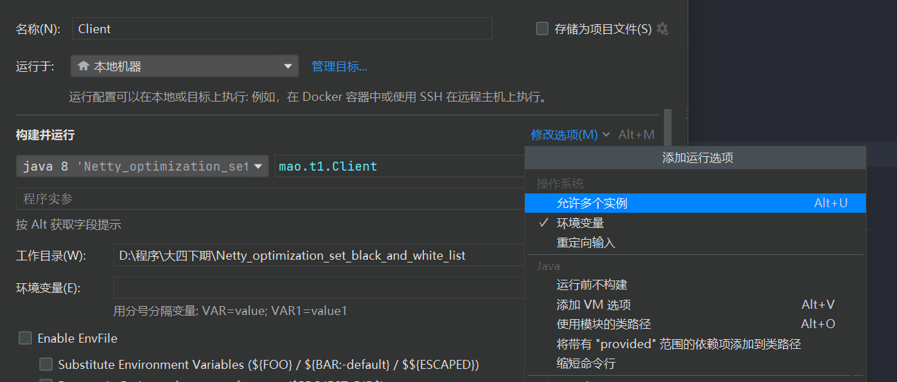

## 设置黑白名单

Netty中的的远端地址过滤器主要通过继承AbstractRemoteAddressFilter抽象类进行实现。默认情况下，如果我们不添加任何地址过滤器就会允许所有ip可以访问


在Netty中默认的地址过滤实现有三个：

- **IpSubnetFilter:** 规则判断的是 Client 的 IP 和规则中的 IP 是否在同一个局域网中；
- **RuleBasedIpFilter:** 基于ip的过滤器，可以自定义哪些ip或者ip范围允许通过或者被阻止，他是一个共享的handle
  - 过滤规则使用了`cidrPrefix`，也就是用 CIDR 的方式表示一个 IP，比如：192.168.31.100/24，其中 24 就是 Netty 中的 `cidrPrefix`
  - `RuleBasedIpFilter`对象是过滤器，而`IpSubnetFilterRule`对象是过滤规则
- **UniqueIpFilter:** 同一个 IP 限制只能有一个连接，是全局共享的handle。


### RuleBasedIpFilter

服务端

```java
package mao.t1;

import io.netty.bootstrap.ServerBootstrap;
import io.netty.channel.ChannelHandlerContext;
import io.netty.channel.ChannelInboundHandlerAdapter;
import io.netty.channel.ChannelInitializer;
import io.netty.channel.SimpleChannelInboundHandler;
import io.netty.channel.nio.NioEventLoopGroup;
import io.netty.channel.socket.nio.NioServerSocketChannel;
import io.netty.channel.socket.nio.NioSocketChannel;
import io.netty.handler.codec.string.StringDecoder;
import io.netty.handler.ipfilter.IpFilterRuleType;
import io.netty.handler.ipfilter.IpSubnetFilterRule;
import io.netty.handler.ipfilter.RuleBasedIpFilter;
import io.netty.handler.logging.LogLevel;
import io.netty.handler.logging.LoggingHandler;
import lombok.SneakyThrows;
import lombok.extern.slf4j.Slf4j;

import java.net.InetAddress;
import java.net.InetSocketAddress;

/**
 * Project name(项目名称)：Netty_optimization_set_black_and_white_list
 * Package(包名): mao.t1
 * Class(类名): Server
 * Author(作者）: mao
 * Author QQ：1296193245
 * GitHub：https://github.com/maomao124/
 * Date(创建日期)： 2023/4/26
 * Time(创建时间)： 13:42
 * Version(版本): 1.0
 * Description(描述)： 设置黑白名单
 */

@Slf4j
public class Server
{
    @SneakyThrows
    public static void main(String[] args)
    {
        //规则判断的是 Client 的 IP 和规则中的 IP 是否在同一个局域网中
        //构造方法：IpSubnetFilterRule(String ipAddress, int cidrPrefix, IpFilterRuleType ruleType)
        IpSubnetFilterRule ipSubnetFilterRule1 = new
                IpSubnetFilterRule("127.0.0.1", 8, IpFilterRuleType.REJECT);
        IpSubnetFilterRule ipSubnetFilterRule2 = new
                IpSubnetFilterRule("192.168.3.1", 24, IpFilterRuleType.REJECT);
        IpSubnetFilterRule ipSubnetFilterRule3 = new
                IpSubnetFilterRule("192.168.7.1", 24, IpFilterRuleType.REJECT);
        IpSubnetFilterRule ipSubnetFilterRule4 = new
                IpSubnetFilterRule("147.11.68.152", 16, IpFilterRuleType.REJECT);
        IpSubnetFilterRule ipSubnetFilterRule5 = new
                IpSubnetFilterRule("113.221.0.1", 16, IpFilterRuleType.REJECT);

        //基于ip的过滤器，可以自定义哪些ip或者ip范围允许通过或者被阻止，他是一个共享的handle
        //构造方法：public RuleBasedIpFilter(IpFilterRule... rules)
        RuleBasedIpFilter ruleBasedIpFilter = new RuleBasedIpFilter(
                ipSubnetFilterRule1,
                ipSubnetFilterRule2,
                ipSubnetFilterRule3,
                ipSubnetFilterRule4,
                ipSubnetFilterRule5);

        new ServerBootstrap()
                .group(new NioEventLoopGroup(), new NioEventLoopGroup())
                .channel(NioServerSocketChannel.class)
                .childHandler(new ChannelInitializer<NioSocketChannel>()
                {
                    @Override
                    protected void initChannel(NioSocketChannel ch) throws Exception
                    {
                        ch.pipeline().addLast(new LoggingHandler(LogLevel.DEBUG))
                                .addLast(new StringDecoder())
                                .addLast(ruleBasedIpFilter)
                                .addLast(new ChannelInboundHandlerAdapter()
                                {
                                    @Override
                                    public void channelRead(ChannelHandlerContext ctx, Object msg) throws Exception
                                    {
                                        log.info("读事件：" + ctx.channel());
                                        super.channelRead(ctx, msg);
                                    }
                                });
                    }
                })
                .bind(8080)
                .sync();

    }
}
```


客户端

```java
package mao.t1;

import io.netty.bootstrap.Bootstrap;
import io.netty.channel.Channel;
import io.netty.channel.ChannelInitializer;
import io.netty.channel.nio.NioEventLoopGroup;
import io.netty.channel.socket.nio.NioSocketChannel;
import io.netty.handler.codec.string.StringEncoder;
import lombok.SneakyThrows;
import lombok.extern.slf4j.Slf4j;

import java.net.InetSocketAddress;

/**
 * Project name(项目名称)：Netty_optimization_set_black_and_white_list
 * Package(包名): mao.t1
 * Class(类名): Client
 * Author(作者）: mao
 * Author QQ：1296193245
 * GitHub：https://github.com/maomao124/
 * Date(创建日期)： 2023/4/26
 * Time(创建时间)： 14:03
 * Version(版本): 1.0
 * Description(描述)： 无
 */
@Slf4j
public class Client
{
    @SneakyThrows
    public static void main(String[] args)
    {
        Channel channel = new Bootstrap()
                .group(new NioEventLoopGroup())
                .channel(NioSocketChannel.class)
                .handler(new ChannelInitializer<NioSocketChannel>()
                {
                    @Override
                    protected void initChannel(NioSocketChannel ch) throws Exception
                    {
                        ch.pipeline().addLast(new StringEncoder());
                    }
                })
                .connect(new InetSocketAddress(8080))
                .sync()
                .channel();
        channel.writeAndFlush("hello");
    }
}
```


启动测试，当前本机ip为113.221.202.104，被ipSubnetFilterRule5过滤


```sh
2023-04-26  14:13:29.274  [nioEventLoopGroup-3-1] DEBUG io.netty.handler.logging.LoggingHandler:  [id: 0x1d10f235, L:/113.221.202.104:8080 - R:/113.221.202.104:55293] REGISTERED
2023-04-26  14:13:29.274  [nioEventLoopGroup-3-1] DEBUG io.netty.handler.logging.LoggingHandler:  [id: 0x1d10f235, L:/113.221.202.104:8080 - R:/113.221.202.104:55293] CLOSE
2023-04-26  14:13:29.274  [nioEventLoopGroup-3-1] DEBUG io.netty.handler.logging.LoggingHandler:  [id: 0x1d10f235, L:/113.221.202.104:8080 ! R:/113.221.202.104:55293] INACTIVE
2023-04-26  14:13:29.274  [nioEventLoopGroup-3-1] DEBUG io.netty.handler.logging.LoggingHandler:  [id: 0x1d10f235, L:/113.221.202.104:8080 ! R:/113.221.202.104:55293] UNREGISTERED
```


再添加一个过滤器，将本机的ip设置成白名单


```java
package mao.t1;

import io.netty.bootstrap.ServerBootstrap;
import io.netty.channel.ChannelHandlerContext;
import io.netty.channel.ChannelInboundHandlerAdapter;
import io.netty.channel.ChannelInitializer;
import io.netty.channel.SimpleChannelInboundHandler;
import io.netty.channel.nio.NioEventLoopGroup;
import io.netty.channel.socket.nio.NioServerSocketChannel;
import io.netty.channel.socket.nio.NioSocketChannel;
import io.netty.handler.codec.string.StringDecoder;
import io.netty.handler.ipfilter.IpFilterRuleType;
import io.netty.handler.ipfilter.IpSubnetFilterRule;
import io.netty.handler.ipfilter.RuleBasedIpFilter;
import io.netty.handler.logging.LogLevel;
import io.netty.handler.logging.LoggingHandler;
import lombok.SneakyThrows;
import lombok.extern.slf4j.Slf4j;

import java.net.InetAddress;
import java.net.InetSocketAddress;

/**
 * Project name(项目名称)：Netty_optimization_set_black_and_white_list
 * Package(包名): mao.t1
 * Class(类名): Server
 * Author(作者）: mao
 * Author QQ：1296193245
 * GitHub：https://github.com/maomao124/
 * Date(创建日期)： 2023/4/26
 * Time(创建时间)： 13:42
 * Version(版本): 1.0
 * Description(描述)： 设置黑白名单
 */

@Slf4j
public class Server
{
    @SneakyThrows
    public static void main(String[] args)
    {
        //规则判断的是 Client 的 IP 和规则中的 IP 是否在同一个局域网中
        //构造方法：IpSubnetFilterRule(String ipAddress, int cidrPrefix, IpFilterRuleType ruleType)
        IpSubnetFilterRule ipSubnetFilterRule1 = new
                IpSubnetFilterRule("127.0.0.1", 8, IpFilterRuleType.REJECT);
        IpSubnetFilterRule ipSubnetFilterRule2 = new
                IpSubnetFilterRule("192.168.3.1", 24, IpFilterRuleType.REJECT);
        IpSubnetFilterRule ipSubnetFilterRule3 = new
                IpSubnetFilterRule("192.168.7.1", 24, IpFilterRuleType.REJECT);
        IpSubnetFilterRule ipSubnetFilterRule4 = new
                IpSubnetFilterRule("147.11.68.152", 16, IpFilterRuleType.REJECT);
        IpSubnetFilterRule ipSubnetFilterRule5 = new
                IpSubnetFilterRule("113.221.0.1", 16, IpFilterRuleType.REJECT);
        //白名单
        IpSubnetFilterRule ipSubnetFilterRule6 = new
                IpSubnetFilterRule("113.221.202.104", 16, IpFilterRuleType.ACCEPT);
        //基于ip的过滤器，可以自定义哪些ip或者ip范围允许通过或者被阻止，他是一个共享的handle
        //构造方法：public RuleBasedIpFilter(IpFilterRule... rules)
        RuleBasedIpFilter ruleBasedIpFilter = new RuleBasedIpFilter(
                //ipSubnetFilterRule6要加在ipSubnetFilterRule5的前面，不然不生效
                ipSubnetFilterRule6,
                ipSubnetFilterRule1,
                ipSubnetFilterRule2,
                ipSubnetFilterRule3,
                ipSubnetFilterRule4,
                ipSubnetFilterRule5);

        new ServerBootstrap()
                .group(new NioEventLoopGroup(), new NioEventLoopGroup())
                .channel(NioServerSocketChannel.class)
                .childHandler(new ChannelInitializer<NioSocketChannel>()
                {
                    @Override
                    protected void initChannel(NioSocketChannel ch) throws Exception
                    {
                        ch.pipeline().addLast(new LoggingHandler(LogLevel.DEBUG))
                                .addLast(new StringDecoder())
                                .addLast(ruleBasedIpFilter)
                                .addLast(new ChannelInboundHandlerAdapter()
                                {
                                    @Override
                                    public void channelRead(ChannelHandlerContext ctx, Object msg) throws Exception
                                    {
                                        log.info("读事件：" + ctx.channel());
                                        super.channelRead(ctx, msg);
                                    }
                                });
                    }
                })
                .bind(8080)
                .sync();

    }
}
```


启动运行

```sh
2023-04-26  14:16:05.775  [nioEventLoopGroup-3-1] DEBUG io.netty.handler.logging.LoggingHandler:  [id: 0x842159e1, L:/113.221.202.104:8080 - R:/113.221.202.104:55739] REGISTERED
2023-04-26  14:16:05.776  [nioEventLoopGroup-3-1] DEBUG io.netty.handler.logging.LoggingHandler:  [id: 0x842159e1, L:/113.221.202.104:8080 - R:/113.221.202.104:55739] ACTIVE
2023-04-26  14:16:05.777  [nioEventLoopGroup-3-1] DEBUG io.netty.util.Recycler:  -Dio.netty.recycler.maxCapacityPerThread: 4096
2023-04-26  14:16:05.777  [nioEventLoopGroup-3-1] DEBUG io.netty.util.Recycler:  -Dio.netty.recycler.maxSharedCapacityFactor: 2
2023-04-26  14:16:05.778  [nioEventLoopGroup-3-1] DEBUG io.netty.util.Recycler:  -Dio.netty.recycler.linkCapacity: 16
2023-04-26  14:16:05.778  [nioEventLoopGroup-3-1] DEBUG io.netty.util.Recycler:  -Dio.netty.recycler.ratio: 8
2023-04-26  14:16:05.781  [nioEventLoopGroup-3-1] DEBUG io.netty.buffer.AbstractByteBuf:  -Dio.netty.buffer.checkAccessible: true
2023-04-26  14:16:05.781  [nioEventLoopGroup-3-1] DEBUG io.netty.buffer.AbstractByteBuf:  -Dio.netty.buffer.checkBounds: true
2023-04-26  14:16:05.782  [nioEventLoopGroup-3-1] DEBUG io.netty.util.ResourceLeakDetectorFactory:  Loaded default ResourceLeakDetector: io.netty.util.ResourceLeakDetector@4b20c1ec
2023-04-26  14:16:05.784  [nioEventLoopGroup-3-1] DEBUG io.netty.handler.logging.LoggingHandler:  [id: 0x842159e1, L:/113.221.202.104:8080 - R:/113.221.202.104:55739] READ: 5B
         +-------------------------------------------------+
         |  0  1  2  3  4  5  6  7  8  9  a  b  c  d  e  f |
+--------+-------------------------------------------------+----------------+
|00000000| 68 65 6c 6c 6f                                  |hello           |
+--------+-------------------------------------------------+----------------+
2023-04-26  14:16:05.785  [nioEventLoopGroup-3-1] INFO  mao.t1.Server:  读事件：[id: 0x842159e1, L:/113.221.202.104:8080 - R:/113.221.202.104:55739]
2023-04-26  14:16:05.785  [nioEventLoopGroup-3-1] DEBUG io.netty.channel.DefaultChannelPipeline:  Discarded inbound message hello that reached at the tail of the pipeline. Please check your pipeline configuration.
2023-04-26  14:16:05.785  [nioEventLoopGroup-3-1] DEBUG io.netty.channel.DefaultChannelPipeline:  Discarded message pipeline : [LoggingHandler#0, StringDecoder#0, Server$1$1#0, DefaultChannelPipeline$TailContext#0]. Channel : [id: 0x842159e1, L:/113.221.202.104:8080 - R:/113.221.202.104:55739].
2023-04-26  14:16:05.785  [nioEventLoopGroup-3-1] DEBUG io.netty.handler.logging.LoggingHandler:  [id: 0x842159e1, L:/113.221.202.104:8080 - R:/113.221.202.104:55739] READ COMPLETE
```


### UniqueIpFilter


服务端

```java
package mao.t2;

import io.netty.bootstrap.ServerBootstrap;
import io.netty.channel.ChannelHandlerContext;
import io.netty.channel.ChannelInboundHandlerAdapter;
import io.netty.channel.ChannelInitializer;
import io.netty.channel.nio.NioEventLoopGroup;
import io.netty.channel.socket.nio.NioServerSocketChannel;
import io.netty.channel.socket.nio.NioSocketChannel;
import io.netty.handler.codec.string.StringDecoder;
import io.netty.handler.ipfilter.UniqueIpFilter;
import io.netty.handler.logging.LogLevel;
import io.netty.handler.logging.LoggingHandler;
import lombok.SneakyThrows;
import lombok.extern.slf4j.Slf4j;

/**
 * Project name(项目名称)：Netty_optimization_set_black_and_white_list
 * Package(包名): mao.t2
 * Class(类名): Server
 * Author(作者）: mao
 * Author QQ：1296193245
 * GitHub：https://github.com/maomao124/
 * Date(创建日期)： 2023/4/26
 * Time(创建时间)： 14:18
 * Version(版本): 1.0
 * Description(描述)： 同一个 IP 限制只能有一个连接：UniqueIpFilter
 */

@Slf4j
public class Server
{
    @SneakyThrows
    public static void main(String[] args)
    {
        UniqueIpFilter uniqueIpFilter = new UniqueIpFilter();
        new ServerBootstrap()
                .group(new NioEventLoopGroup(), new NioEventLoopGroup())
                .channel(NioServerSocketChannel.class)
                .childHandler(new ChannelInitializer<NioSocketChannel>()
                {
                    @Override
                    protected void initChannel(NioSocketChannel ch) throws Exception
                    {
                        ch.pipeline().addLast(new LoggingHandler(LogLevel.DEBUG))
                                .addLast(new StringDecoder())
                                .addLast(uniqueIpFilter)
                                .addLast(new ChannelInboundHandlerAdapter()
                                {
                                    @Override
                                    public void channelRead(ChannelHandlerContext ctx, Object msg) throws Exception
                                    {
                                        log.info("读事件：" + ctx.channel());
                                        super.channelRead(ctx, msg);
                                    }

                                    @Override
                                    public void channelActive(ChannelHandlerContext ctx) throws Exception
                                    {
                                        log.info("客户端连接：" + ctx.channel().remoteAddress());
                                        super.channelActive(ctx);
                                    }
                                });
                    }
                })
                .bind(8080)
                .sync();
    }
}
```


编辑配置，允许多个客户端实例




启动第一个客户端，服务端打印日志：

```sh
2023-04-26  14:21:11.384  [nioEventLoopGroup-3-1] DEBUG io.netty.handler.logging.LoggingHandler:  [id: 0x0658d4d9, L:/113.221.202.104:8080 - R:/113.221.202.104:54406] REGISTERED
2023-04-26  14:21:11.384  [nioEventLoopGroup-3-1] DEBUG io.netty.handler.logging.LoggingHandler:  [id: 0x0658d4d9, L:/113.221.202.104:8080 - R:/113.221.202.104:54406] ACTIVE
2023-04-26  14:21:11.384  [nioEventLoopGroup-3-1] INFO  mao.t2.Server:  客户端连接：/113.221.202.104:54406
2023-04-26  14:21:11.386  [nioEventLoopGroup-3-1] DEBUG io.netty.util.Recycler:  -Dio.netty.recycler.maxCapacityPerThread: 4096
2023-04-26  14:21:11.386  [nioEventLoopGroup-3-1] DEBUG io.netty.util.Recycler:  -Dio.netty.recycler.maxSharedCapacityFactor: 2
2023-04-26  14:21:11.386  [nioEventLoopGroup-3-1] DEBUG io.netty.util.Recycler:  -Dio.netty.recycler.linkCapacity: 16
2023-04-26  14:21:11.386  [nioEventLoopGroup-3-1] DEBUG io.netty.util.Recycler:  -Dio.netty.recycler.ratio: 8
2023-04-26  14:21:11.390  [nioEventLoopGroup-3-1] DEBUG io.netty.buffer.AbstractByteBuf:  -Dio.netty.buffer.checkAccessible: true
2023-04-26  14:21:11.390  [nioEventLoopGroup-3-1] DEBUG io.netty.buffer.AbstractByteBuf:  -Dio.netty.buffer.checkBounds: true
2023-04-26  14:21:11.390  [nioEventLoopGroup-3-1] DEBUG io.netty.util.ResourceLeakDetectorFactory:  Loaded default ResourceLeakDetector: io.netty.util.ResourceLeakDetector@55e8938f
2023-04-26  14:21:11.393  [nioEventLoopGroup-3-1] DEBUG io.netty.handler.logging.LoggingHandler:  [id: 0x0658d4d9, L:/113.221.202.104:8080 - R:/113.221.202.104:54406] READ: 5B
         +-------------------------------------------------+
         |  0  1  2  3  4  5  6  7  8  9  a  b  c  d  e  f |
+--------+-------------------------------------------------+----------------+
|00000000| 68 65 6c 6c 6f                                  |hello           |
+--------+-------------------------------------------------+----------------+
2023-04-26  14:21:11.394  [nioEventLoopGroup-3-1] INFO  mao.t2.Server:  读事件：[id: 0x0658d4d9, L:/113.221.202.104:8080 - R:/113.221.202.104:54406]
2023-04-26  14:21:11.394  [nioEventLoopGroup-3-1] DEBUG io.netty.channel.DefaultChannelPipeline:  Discarded inbound message hello that reached at the tail of the pipeline. Please check your pipeline configuration.
2023-04-26  14:21:11.394  [nioEventLoopGroup-3-1] DEBUG io.netty.channel.DefaultChannelPipeline:  Discarded message pipeline : [LoggingHandler#0, StringDecoder#0, Server$1$1#0, DefaultChannelPipeline$TailContext#0]. Channel : [id: 0x0658d4d9, L:/113.221.202.104:8080 - R:/113.221.202.104:54406].
2023-04-26  14:21:11.394  [nioEventLoopGroup-3-1] DEBUG io.netty.handler.logging.LoggingHandler:  [id: 0x0658d4d9, L:/113.221.202.104:8080 - R:/113.221.202.104:54406] READ COMPLETE
```


第一个客户端不要关闭，启动第二个客户端，服务端打印：

```sh
2023-04-26  14:23:30.131  [nioEventLoopGroup-3-3] DEBUG io.netty.handler.logging.LoggingHandler:  [id: 0xe2bee0dc, L:/113.221.202.104:8080 - R:/113.221.202.104:54569] REGISTERED
2023-04-26  14:23:30.131  [nioEventLoopGroup-3-3] DEBUG io.netty.handler.logging.LoggingHandler:  [id: 0xe2bee0dc, L:/113.221.202.104:8080 - R:/113.221.202.104:54569] CLOSE
2023-04-26  14:23:30.132  [nioEventLoopGroup-3-3] DEBUG io.netty.handler.logging.LoggingHandler:  [id: 0xe2bee0dc, L:/113.221.202.104:8080 ! R:/113.221.202.104:54569] INACTIVE
2023-04-26  14:23:30.132  [nioEventLoopGroup-3-3] DEBUG io.netty.handler.logging.LoggingHandler:  [id: 0xe2bee0dc, L:/113.221.202.104:8080 ! R:/113.221.202.104:54569] UNREGISTERED
```


